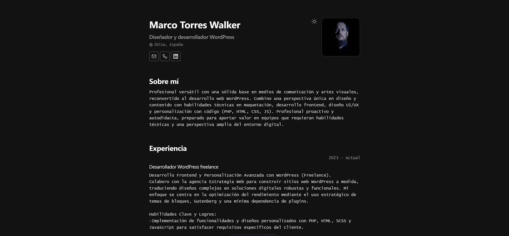

# Minimalist CV / Portfolio

This project is a minimalist CV/Portfolio builder that uses a JSON file to store your data. It's based on the JSONResume schema and the design of Bartosz Jarocki's CV.

CV JSON schema from
https://jsonresume.org/schema/

Based on the design of
https://github.com/BartoszJarocki/cv

Edit the content of the cv.json file to update your Portfolio/CV.



## Stack

- [**Astro**](https://astro.build/) - The trendy framework
- [**Javascript**](https://developer.mozilla.org/en-US/docs/Web/JavaScript) - Programming language
- [**Ninja keys**](https://github.com/ssleptsov/ninja-keys) - Command palette with keyboard shortcuts in vanilla javascript

## Getting Started

1.  **Clone the repository:**
    ```bash
    git clone https://github.com/GWKaplan/cv-porfolio-json.git
    ```
2.  **Navigate to the project directory:**
    ```bash
    cd cv-porfolio-json
    ```
3.  **Install dependencies:**
    ```bash
    npm install
    ```
    (or `pnpm install` or `yarn install` depending on your preferred package manager)
4.  **Edit `cv.json`:**
    Update the `cv.json` file with your personal information.
5.  **Run the development server:**
    ```bash
    npm run dev
    ```
    This will start a local development server. Open your browser and go to `http://localhost:4321` to see your CV/Portfolio.

## Usage

Once you have completed the setup steps:

1.  **Edit `cv.json`:**
    Modify the `cv.json` file in the root directory to update your personal information, experience, education, skills, and projects. The schema is based on [JSONResume](https://jsonresume.org/schema/).
2.  **View your CV/Portfolio:**
    If the development server is running (`npm run dev`), changes to `cv.json` should automatically reload in your browser. Otherwise, restart the development server.
3.  **Build for production:**
    When you are ready to deploy your site, run:
    ```bash
    npm run build
    ```
    This will create a `dist/` folder with the static files for your site.

## Contributing

Contributions are welcome! If you'd like to contribute to this project, please follow these steps:

1.  Fork the repository.
2.  Create a new branch (`git checkout -b feature/your-feature-name`).
3.  Make your changes.
4.  Commit your changes (`git commit -m 'Add some feature'`).
5.  Push to the branch (`git push origin feature/your-feature-name`).
6.  Open a pull request.

Please make sure to update tests as appropriate.

## License

[MIT](LICENSE.txt)
